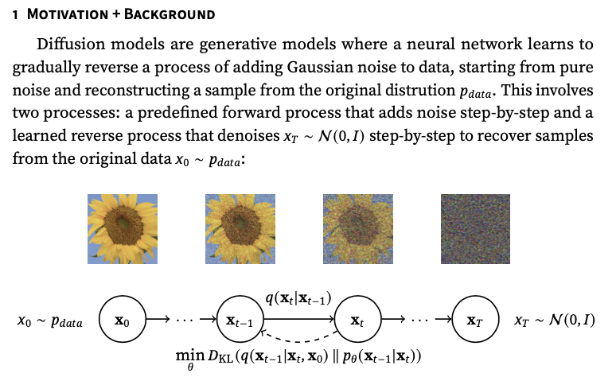
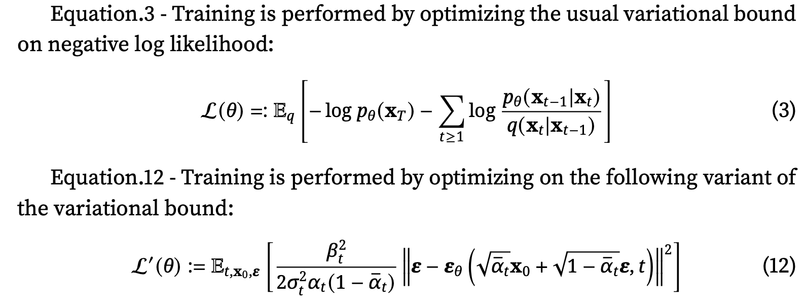

# 1D Diffusion Model Implementation

This repository contains a custom implementation of a 1D Diffusion Model inspired by the **Denoising Diffusion Probabilistic Models (DDPM)** paper. The code was developed from scratch, drawing insights from annotated examples and visualization techniques encountered during the research process. This implementation successfully learns the target distributions and provides a simplified yet effective approach to DDPM.

---

## Overview

The implementation follows the key principles outlined in the DDPM paper, including the forward and reverse diffusion processes. The model is trained using the variational bound and its simplified variant to optimize the diffusion process.

### Key Equations

## Implementation Details

### Forward Process
- **Total Time Steps**: $T = 1000$, consistent with prior work.
- **Variance Schedule**: $\beta_t = \beta = 0.02$, fixed over time.
- **Alpha Schedule**:
  - Linear: $\alpha_t = \alpha = 1 - \beta$
  - Cumulative Product: $\bar{\alpha}_t = \prod_{s=1}^t \alpha$

### Reverse Process
- Parameterized using neural networks trained on:
  - Full variational bound: $\mathcal{L}(\theta)$
  - Simplified variant: $\mathcal{L}'(\theta)$
- **Model Architecture**:
  - A lightweight feedforward neural network.
  - Naive positional encoding for time steps.
  - Basic scaling $[1, 0]$.
- **Design Choice**: A simpler architecture was chosen over the original U-Net and attention-heavy models due to the lightweight nature of the dataset.

---

## Visualization and Results
The implementation includes visualizations that demonstrate the learning process and the model's success in approximating target distributions.

---

## References
- DDPM Paper: [Denoising Diffusion Probabilistic Models](https://arxiv.org/abs/2006.11239)
- Annotated Examples: Refer to the documentation and community examples explored during the development process.

---

Feel free to explore the code and extend the implementation for more complex datasets or applications. Contributions and feedback are welcome!
